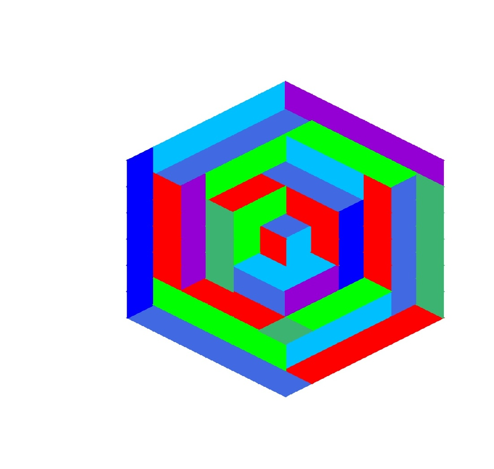
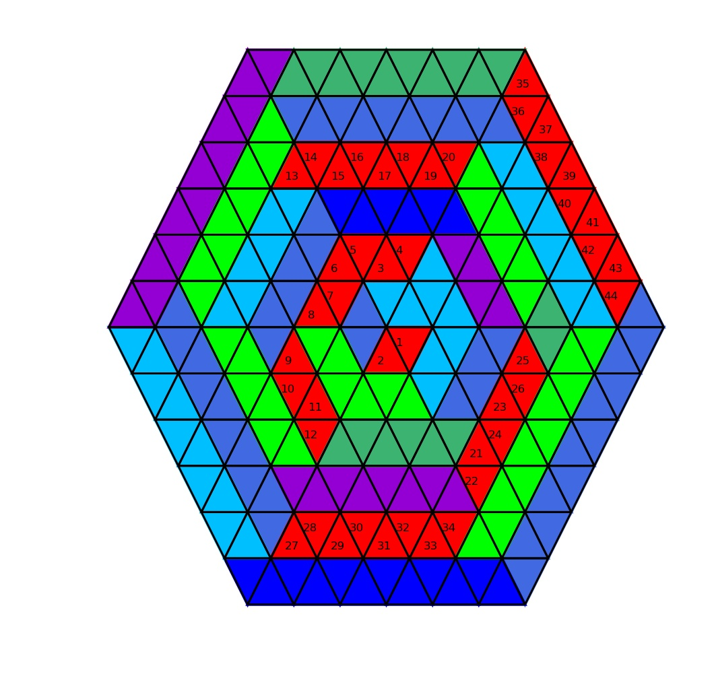

# Vasarely VIII Sin-Hat-A
Programme en Python 3 permettant de dessiner l'œuvre de [Victor Vasarely](https://fr.wikipedia.org/wiki/Victor_Vasarely) VIII Sin-Hat-A (1974).

## Condition requises
- [Python 3.x](https://www.python.org/)
- [Matplotlib](https://matplotlib.org/) (Généralement inclu dans les distributions Python)
- [Scipy](https://www.scipy.org/) (Uniquement pour tourner l'image de 90°, si ce module n'est pas disponible, on peut le faire à part avec un logiciel de traitement d'image, dans un traitement de texte, etc.)

## Description
La figure est tracée dans un premier temps tournée de 90° avec des triangles vers le haut et vers le bas puis tournée comme sur l'original. 
Accessoirement le programme permet de compter le nombre de triangles rouges, comme demandé dans l'exercice 86, page 73, Nathan Trans Math 6ème (Programme 2016).

 	
